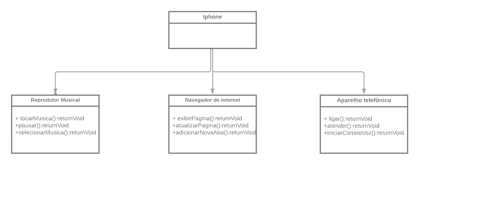

# Iphone Desafio DIO
## Modelagem e Diagramação de um Componente iPhone
Desafio inspirado na palestra Steve Jobs em que ele apresenta o primeiro iPhone. Aplicando os conhecimentos ensinados no bootcamp java com IA, criei um sistema que une três funções de softwares diferentes em um software só, assim como a criação do Iphone.

## Projeto
Neste projeto foi usado a linguagem .java e um diagrama UML. A partir do diagrama e conceitos de programação orientada a objetos foi criado classes, funções e interfaces que visam assemelhassem ao Iphone.

## Link da palestra
[Lançamento Iphone 2007](https://youtu.be/9ou608QQRq8?si=h6MpTKuwm4dZXfRU)

### Adicionais
Este projeto foi criado com o objetivo de por em prática o aprendizado. Mas agradeço se tiver uma ideia de como posso melhora-lo.
